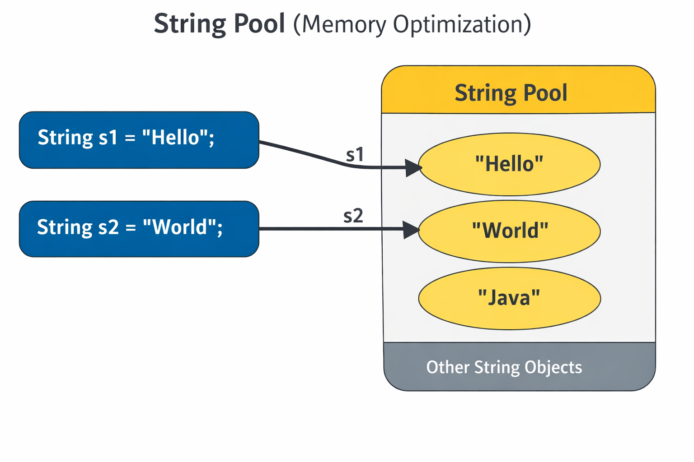

# String

- A String is one of the most commonly used classes. 
- It represents a sequence of characters (text).

```
    String name = "Saravanan";
    
```

## Key Features of Strings

- Immutable  → Once created, cannot be changed
- Stored in String Pool (memory optimization)




- Can be created using literals or new keyword
   
   ```
   String s1 = "Hello";              // String Literal
   String s2 = new String("Hello");  // new keyword
   ```